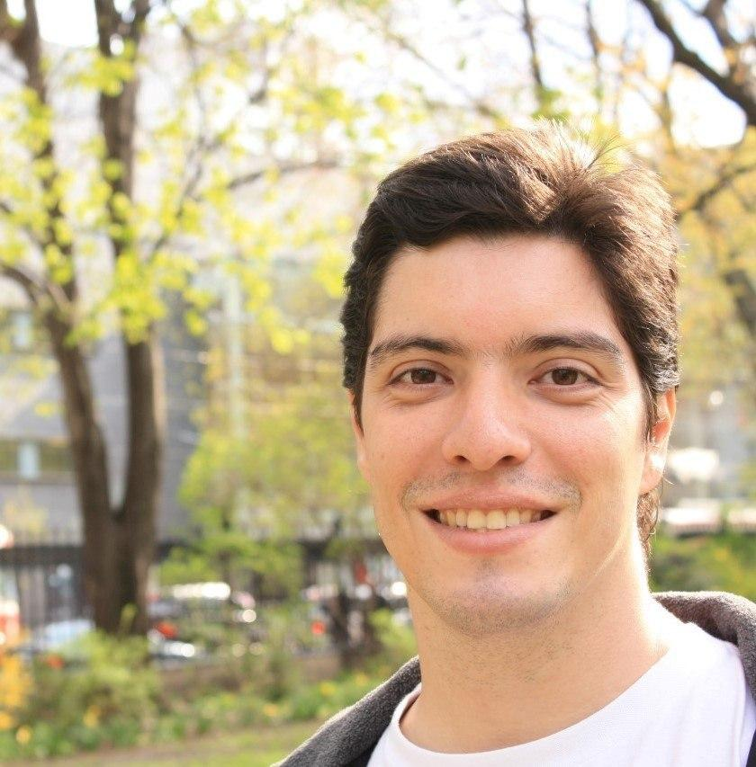

# Mia-Ajuda Documentation

## Mia-Ajuda

É um projeto criado e desenvolvido por professores e estudantes da Faculdade do Gama (FGA), da Universidade de Brasília, com o intuito de contribuir com a sociedade em um momento de necessidade que estamos vivendo em relação à CoVid-19. O aplicativo tem o propósito de ser uma ferramenta de incentivo a ações sociais de ajuda e colaboração entre pessoas de comunidades e vizinhanças. O Mia Ajuda serve como um meio de ligação entre pessoas necessitadas e voluntários que possam ajudar, seja de forma imaterial (entretenimento, companhia, amparo psicológico), como de forma material (comida, objetos, itens de higiene pessoal).

### Ambiente desenvolvimento

Criamos um ambiente para disponibilizar os artefatos desenvolvidos. Portanto, utilizamos o:

`docsify` - É uma ferramenta para criação e desenvolvimento de documentações em __Markdown__, tornando mais agradável para o desenvolvedor configurar todo o design do site e também, consequentimente, podendo melhorar a legibilidade para o leitor.

`Docker` - Docker é utilizado para criar uma ambiente isolado para desenvolvimento, a fim de não comprometer as maquinas dos desenvolvedores e também para mater uma versão única de desenvolvimento.

#### Rodando o ambiente

Para funcionar o ambiente de desenvolvimento basta rodar os seguintes comandos:

    $ make create

Isto irá buildar o ambiente.

    $ make server

E então este último irá rodar o container da documentação.

Para vizualizar basta acessar:

    http://localhost:3000

## Quem somos

## Equipe

|Foto                           |E-mail                       |Github           |
|-----------------------------------|-----------------------------|-----------------|
|    |mileneserrano@gmail.com      |[@milenserrano](https://github.com/mileneserrano)|
|   |serr.mau@gmail.com           |[@mauserr](https://github.com/mauserr)|
|    |esio.gustavo@gmail.com       |[@EsioFreitas](https://github.com/EsioFreitas)      |
|        |gdavi.gd@gmail.com           |[@gabrieldvpereira](https://github.com/gabrieldvpereira)  |
|       |pheofo@gmail.com             |[@phe0](https://github.com/phe0) |
|       |welison.almeida.923@gmail.com|[@WelisonR](https://github.com/WelisonR)|
|     |junio.pereirab@gmail.com     |[@juniopereirab](https://github.com/juniopereirab) |
||leossb36@gmail.com           |[@leossb36](https://github.com/leossb36)|
|               |ivandinizdobbin2@gmail.com   |[@darmsDD](https://github.com/darmsDD)|
||saleh.nazih.dev@gmail.com|[@devsalula](https://github.com/devsalula)|
||dudamelo82@gmail.com|[@dudamelo82](https://github.com/dudamelo82)|
||isudjoao@gmail.com|[@sudjoao](https://github.com/sudjoao)|

## Colaboradores antigos

|Foto                        |E-mail                         |Github                 |
|----------------------------|-------------------------------|-----------------------|
|            |leonardodasigomes@gmail.com  |[@LeoSilvaGomes](https://github.com/LeoSilvaGomes)    |
||matheus.estanislau7@gmail.com|[@MatheusEstanislau](https://github.com/MatheusEstanislau) |
|               |eduardolima.df@gmail.com     |[@Ed-vL](https://github.com/Ed-vL)|
|      |joberth.rogers18@gmail.com   |[@joberthrogers18](https://github.com/joberthrogers18) |
|  |ebmm01@gmail.com             |[@ebmm01](https://github.com/ebmm01) |
|      |luishptaira@gmail.com        |[@LhTaira](https://github.com/LhTaira) |
|            |eduardolimrib@gmail.com      |[@Eduardolimr](https://github.com/Eduardolimr)|
|       |gmanso@mit.edu               |[@gabrielfilipe7unb](https://github.com/gabrielfilipe7unb)|
||lucas.soaresouza@gmail.com|[@lucassoaresouza](https://github.com/lucassoaresouza)|
||hugosobral10@gmail.com|[@KiSobral](https://github.com/KiSobral)|
||marquesguilherme3@gmail.com|[@guilhesme23](https://github.com/guilhesme23)|
||kamillacosta.unb@gmail.com|[@KahCosta](https://github.com/KahCosta)|