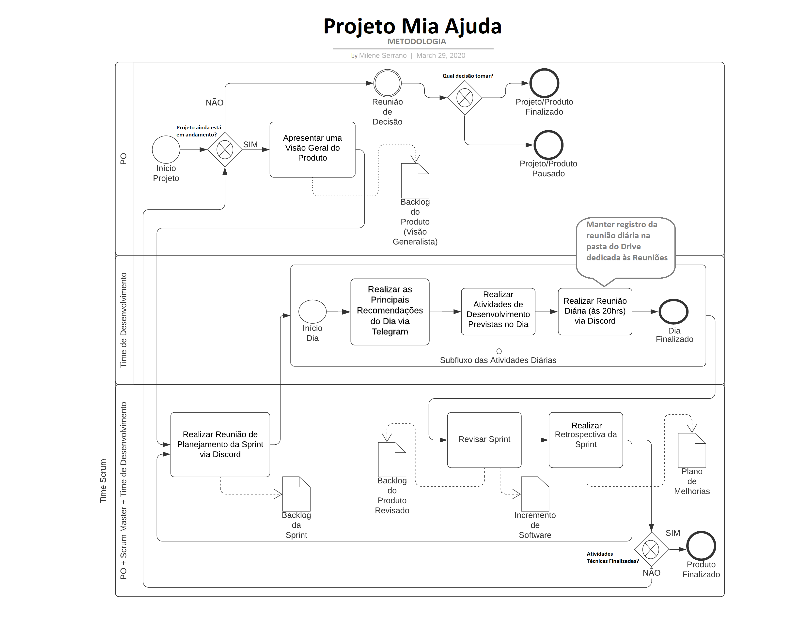

# Metodologia

#### Histórico de Revisões
|Nome |  Versão | Descrição |  Data    |
|-----------------------------------|--------------------|---------------|-----------------|
| Milene Serrano | 1.0 | Diagramação e modelo original |29 Mar 2020 |
| Eduardo Lima | 1.0.1 | Texto e transferência para Wiki | 01 Abr 2020 |

A seguir está diagramada, de forma visual, a metodologia que será usada durante o desenvolvimento da aplicação Mia Ajuda:

Se trata de uma adaptação do **Scrum**, onde temos um **P.O**  (Product Owner), um **time de desensolvimento**  e um **Scrum Master**, cujas funções serão explicadas a seguir.

## Papéis
- O Product Owner ou dono do produto é aquele indivíduo ou grupo de indivíduos que atuam na disponibilização da visão geral do produto para o restante do time, além de ser o principal ator durante a tomada de decisões acerca do projeto como um todo. Seu principal artefato gerado é o Product Backlog, que é a lista de funcionalidades desejadas de um produto.

- O Time de Desenvolvimento é o grupo de indivíduos que atuam ativamente no desenvolvimento do projeto com o apoio do Scrum Master, que estabelece metas e prazos para o cumprimento dessas metas. Seus principais artefatos são as User Stories, que ao final de uma sprint ou uma meta podem se tornar features completas e ao final do projeto compõem o produto em si.

- O Scrum Master é aquele indivíduo responsável por gerir o time de desenvolvimento e estipular prazos tendo como base a visão geral do produto e o feedback com o Product Owner. Para isso, divide o processo de desenvolvimento em ciclos, chamados **sprints**. Seu principal artefato gerado é a Retrospectiva da Sprint, onde são avaliados os pontos altos, baixos e melhorias de cada ciclo afim de manter a produtividade e resultado do time.