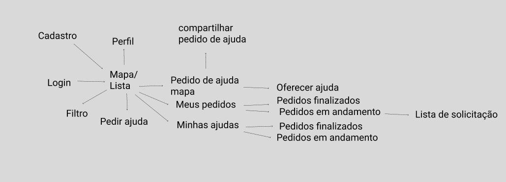

# Principais Funcionalidades (até o momento)

#### Histórico de Revisões
|Nome |  Versão | Descrição |  Data    |
|-----------------------------------|--------------------|---------------|-----------------|
| Esio Gustavo Freitas | 1.0.1 | Fluxo Desenhado |28 Mar 2020 |
| Todos | 1.0 | Esboço de Funcionalidades |29 Mar 2020 |

## CRUD Usuário
- Cadastrar Usuário
    - Criar Cadastro de Usuário
    - Ler Cadastro de Usuário
    - Atualizar Cadastro de Usuário
    - Remover Cadastro de Usuário

## CRUD Ajuda
- Cadastrar Ajuda
    - Criar Cadastro de Ajuda
 Obs: Essa criação tem que ser baseada nas categorias pré-estabelecidas. Então, tem que apresentar as mesmas via combo. Temos que decidir sobre essas categorias para fechamento do projeto piloto. Além disso, tem que permitir que seja inserida uma categoria nova, mas a mesma precisará ser validada por um moderador, antes de ser disponibilizada de fato no combo. Portanto, essa funcionalidade “Criar Cadastro de Ajuda” está atrelada às funcionalidades: Permitir Seleção da Categoria via Combo e Solicitar Criação de uma Nova Categoria.
    - Ler Cadastro de Ajuda
    - Atualizar Cadastro de Ajuda
    - Remover Cadastro de Ajuda

## Filtragem de Ajuda
- Filtrar Ajuda
    - Filtrar Ajuda por Idade
    - Filtrar Ajuda por Estado
    - Filtrar Ajuda por Estado e Cidade
    - Filtrar Ajuda por Categorias

## Login Interativo
- Realizar Login Interativo
    - Realizar Login Interativo via Facebook
    - Realizar Login Interativo via Gmail

## Edição de Perfil
- Editar Perfil
Obs.: cpf/cnpj não podem ser alterados por questão de segurança

## Geolocalização
- Obter Geolocalização do Usuário
	- Quando o usuário acessar o aplicativo
	- Quando o usuário for cadastrar uma necessidade.

## Compartilhamento de Pedido de Ajuda
- Compartilhar Pedido de Ajuda
	-link compartilhável

## Oferta de Ajuda
- Oferecer Ajuda

Meus Pedidos
- Visualizar Meus Pedidos
- Acompanhar Meus Pedidos
	- Acompanhar Meus Pedidos em Andamento
            - Listar Ofertas de ajudas
	- Acompanhar Meus Pedidos Finalizados

## Minhas Ajudas
- Visualizar Minhas Ajudas
- Acompanhar Minhas Ajudas
    - Acompanhar Minhas Ajudas em Andamento
    - Acompanhar Minhas Ajudas Finalizadas
- Cancelar Pedido de Ajuda

## Categorias de ajuda
- Apoio Social
- Apoio Psicológico
- Itens de Proteção
- Higiene Pessoal
- Medicamentos
- Pequenos Serviços
- Suprimentos Básicos
- Transporte de Emergência
- Apoio Físico

